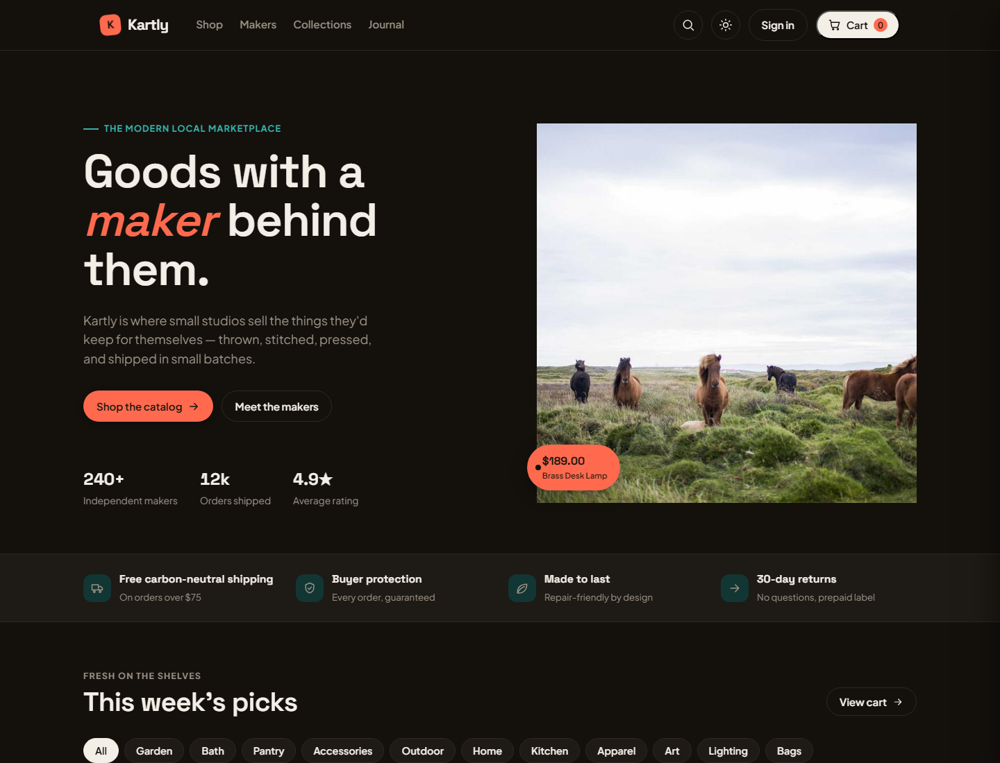
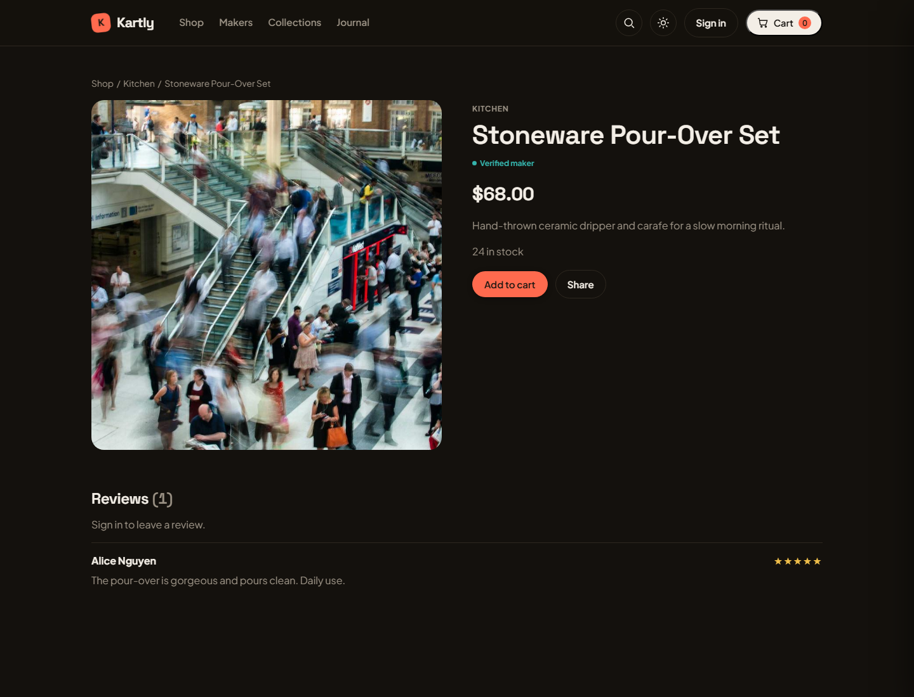
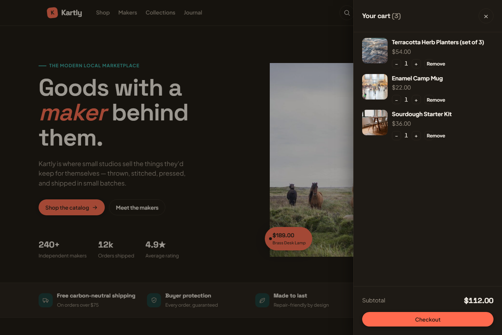

# Kartly

> ## ⚠️ INTENTIONALLY VULNERABLE — EDUCATIONAL LAB
> **This app ships 24 deliberately-planted security vulnerabilities. NEVER deploy a running instance to a public or live URL. Run it LOCALLY ONLY (`127.0.0.1`).**
>
> Standing up a live copy would put an exploitable target on the internet. Like **OWASP Juice Shop, DVWA, and WebGoat**, the **source is meant to be read and published** — the prohibition is on **running a live exploitable instance**, *not* on sharing the code. Publish write-ups, fork it, star it; just don't host a running one.

Kartly is a polished, believable e‑commerce storefront — small‑batch makers, everyday goods — built as an **AppSec teaching lab**: *build web apps, break them, then fix them.* It looks and behaves like a real product, but `main` is riddled with the kinds of bugs real developers ship, each paired with a clean, production‑quality fix on its own branch.

---

## The teaching model: `main` = vulnerable, `fix/*` = remediated

| Branch | What it is |
|--------|------------|
| **`main`** | Every one of the 24 vulnerabilities is **live**. This is the "before." |
| **`fix/<slug>`** | One branch per vulnerability, cut from `main`, containing the **minimal** fix for exactly that class. Opened as a PR against `main` and **never merged** — merging one would delete the very bug it teaches. |

**The diff between `main` and each `fix/<slug>` branch is the teaching artifact** — it shows exactly what the vulnerable code looked like and precisely what changed to remediate it. That's the "break it → fix it" content, one post per class.

- **The master index is [`VULNS.md`](./VULNS.md)** — every vulnerability with *Where · Vulnerable code · Exploit (exact payload) · Impact · Fix · Detect*.
- **Proof, both directions:** exploit tests in `server/tests/exploits/` prove each bug is live on `main`; fixed tests in `server/tests/fixed/` reuse the **same attack code** and prove the bug is closed on its `fix/*` branch.
- **Captured artifacts:** `artifacts/<class>/` holds each exploit receipt (`exploit.txt`), the remediation diff (`fix-diff.diff`), and a ready‑to‑file PR body (`PR.md`).

The 24 classes cover the OWASP Top 10 plus the extended web classes (SSTI, XXE, path traversal, command injection, open redirect, mass assignment, JWT, CORS, business logic). Full matrix in [`VULNS.md`](./VULNS.md).

---

## Screenshots

| Storefront | Product page | Cart |
|---|---|---|
|  |  |  |

---

## Run it (locally only)

Requires Docker. **Every published port in `docker-compose.yml` is bound to `127.0.0.1`** — the stack is not reachable from your network, and it must stay that way. Do not change the binds to `0.0.0.0` and do not add deploy config.

```bash
cp .env.example .env        # optional — compose has safe local defaults
docker compose up --build
# Storefront → http://localhost:4000
# API docs   → http://localhost:4000/api/docs   (Swagger)
# API health → http://localhost:4000/api/health
```

The container migrates the schema, seeds a rich catalog + demo users, and serves the built SPA. `docker compose down -v` wipes the volumes for a clean slate.

### Seeded logins (throwaway, local only)

| Role | Email | Password |
|------|-------|----------|
| Admin | `admin@kartly.test` | `admin1234` |
| Seller | `seller@kartly.test` | `seller1234` |
| Customer | `alice@kartly.test` | `alice1234` |
| Customer | `bob@kartly.test` | `bob1234` |
| Customer | `carol@kartly.test` | `carol1234` |

> The dangerous classes (SSRF, RCE, file upload, XXE, LFI) are **sandboxed to the container** and only ever touch planted decoy files under `server/decoys/` — never real host secrets, cloud metadata, or outbound egress.

### Tests (both-outcomes)

```bash
npm run test        --workspace server   # exploit suite — passes on `main` (bugs live)
npm run test:fixed  --workspace server   # fixed suite — fails on `main`, passes on each fix/* branch
```

Both run black‑box HTTP against the running app (`KARTLY_URL`, default `http://localhost:4000`).

### Local dev (without Docker for the app)

```bash
npm install
docker compose up -d db          # Postgres only
npm run dev                      # client (5173) + server (4000)
```

---

## Stack & layout

Node/Express (layered routes → controllers → services → data), Prisma + PostgreSQL, JWT auth (access/refresh/reset), EJS server‑rendered surfaces, Zod validation, and a React + Vite storefront. TypeScript strict throughout; OpenAPI/Swagger at `/api/docs`.

```
kartly/
  server/    Express API + EJS views + Prisma + tests (exploits & fixed)
  client/    React + Vite storefront
  artifacts/ per-class exploit receipts, fix diffs, PR bodies
  VULNS.md   the master vulnerability index
  docker-compose.yml   localhost-only stack
```

---

## Intent

An educational security lab in the tradition of OWASP Juice Shop, DVWA, and WebGoat. Read it, learn from it, publish write‑ups from it — just **don't stand up a live exploitable instance.**
